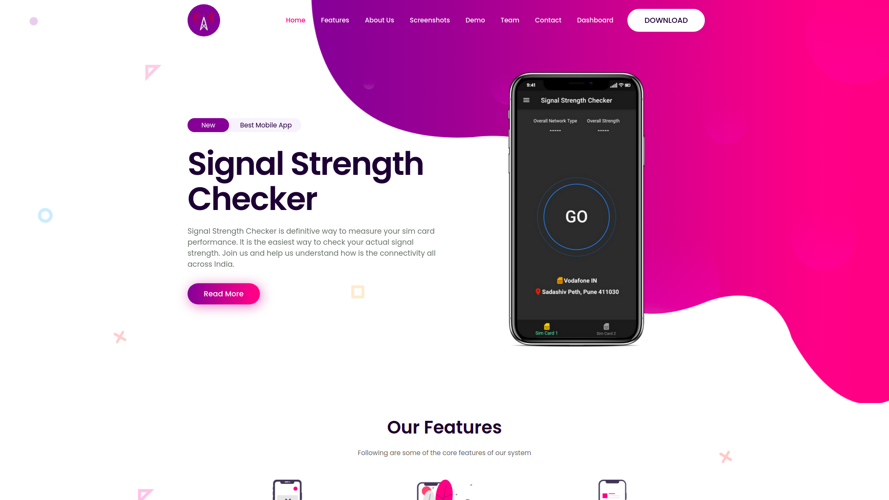

# Signal Strength Checker - Web Dashboard

Visit : https://signal-strength-dashboard.herokuapp.com/ -> Dashboard  
Related App : https://github.com/bpagare6/Signal-Strength-Checker-Android-App

<table><tr><td>
    
</td></tr></table>

Web Dashboard built for visualizing data collected from Signal Strength Checker Mobile App.
This will help us understand connectivity across India for various operators.

### How To Run
- Requirements : Python 3.7.4
- Install Dependency : `pip install -r requirements.txt`
- Migrate Database : `python manage.py migrate`
- Run Server : `python manage.py runserver`

Current Status : Work is under progress (area-wise representation in map left)